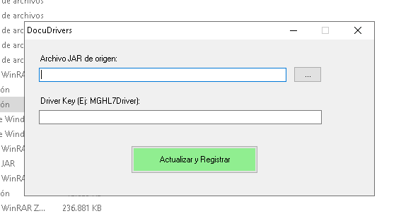

# DocuDrivers 🛠️

**DocuDrivers** es una utilidad en PowerShell (GUI y CLI) para actualizar clases y registrar drivers dentro de `MultiOnline.jar` y actualizar su fichero de propiedades.

---

## 📌 Características

- Interfaz gráfica en PowerShell para seleccionar un archivo JAR y un código de driver.
- Sustituye clases (.class) dentro de `MultiOnline.jar` por las del JAR fuente.
- Añade la entrada correspondiente en `multionline_drivers.properties` si no existe.
- Ejecuta la utilidad `MultiOnlineCommandLine.exe` para registrar drivers (si está presente).

---

## ⚙️ Requisitos

- Windows (script probado en Windows). 
- PowerShell con permisos de **Administrador** (obligatorio para modificar `C:\Program Files (x86)\...`).
- `MultiOnline.jar` localizado por defecto en `C:\Program Files (x86)\Modulab\MultiOnline.jar`.
- Ejecutable opcional `MultiOnlineCommandLine.exe` en `C:\Program Files (x86)\Modulab\`.

---

## 🚀 Uso

### Interfaz gráfica (recomendada)
- Ejecuta: `powershell -ExecutionPolicy Bypass -File .\DocuDriversGUI.ps1`
- Rellena los campos:
  - `Archivo JAR de origen` → archivo .jar con la clase nueva
  - `Driver Key` → por ejemplo: `MGHL7Driver`
- Haz clic en **Actualizar y Registrar**. El script pedirá permisos si no se ejecuta como Administrador.



### Línea de comandos
- Ejemplo:
  ```powershell
  powershell -ExecutionPolicy Bypass -File .\DocuDriversGUI.ps1 -sourcePath "C:\ruta\a\driver.jar" -codigo "MGHL7Driver"
  ```

> Nota: El script valida la existencia del JAR y aborta si no se encuentra el origen.

---

## 📄 Atribución de iconos

Los iconos `escultura.ico` y `escultura.png` requieren atribución:

> "Icono por Freepik de www.flaticon.com"

Consulta `ATTRIBUTION.md` para más detalles.

---

## 📜 Licencia

Este proyecto se distribuye bajo **GNU Lesser General Public License v3 (LGPL v3)**. Consulta el archivo `LICENSE` en la raíz del repositorio.
---

## Contribuir

- Si encuentras un error o quieres proponer mejoras, abre un issue o envía un PR. Mantén los cambios claros y documentados.

---

## Contacto

- Autor: Antonio Gonzalo (<agonzalo@werfen.com>)

---